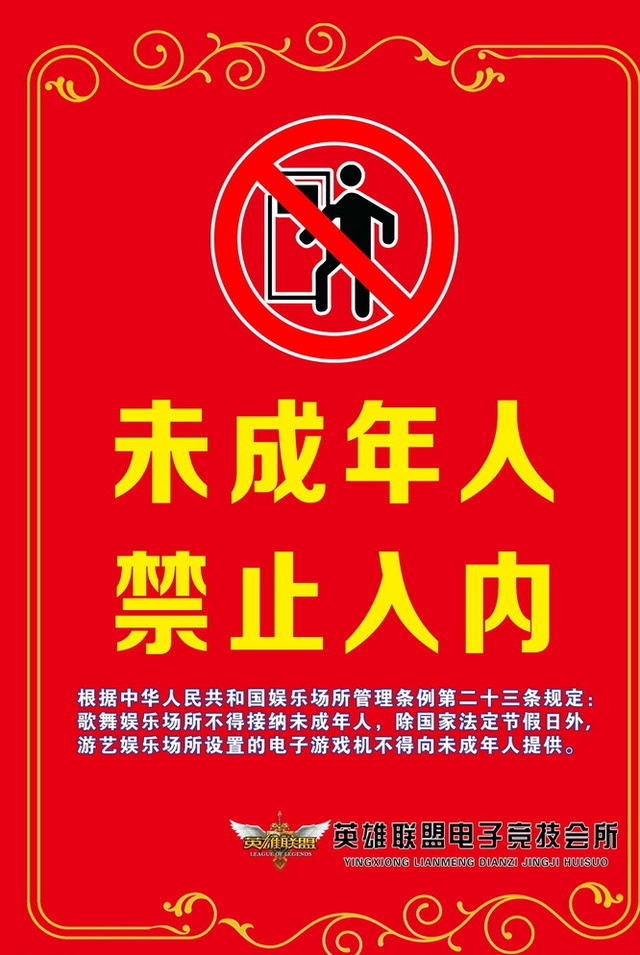
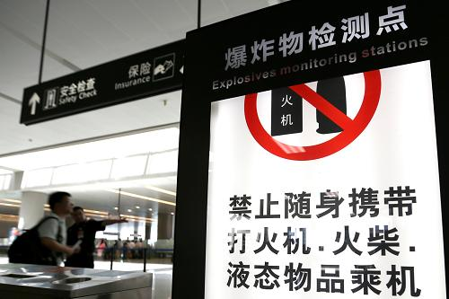
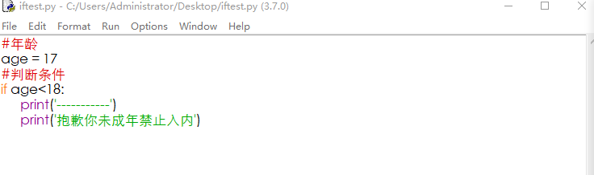

# 12.判断语句

## **判断语句介绍:**

### **生活中的判断场景:**

歌舞娱乐网吧等场所，都禁止未成年进入。




安检，规定也是不能携带命令禁止的物品乘机。



实际开发中的判断：

密码判断：


### if判断语句：

if判断语句介绍

if语句是用来进行判断的，使用格式：

```python
if 条件:
    条件成立时，要做的事情
```



练一练：

要求从键盘获取输入的年龄，判断是否大于或者等于18岁，如果满足，输出，‘您好，祝您玩儿的愉快！’如果不满足，输出‘抱歉，您的年龄不够还是回家睡觉去吧！’

### If else:

在用if时他只能对满足条件时，运行以下代码，要是希望不满足条件情况下也要输出某些代码怎么办？

那就是用else

```python
if-else的使用格式
    if 条件:
        满足条件时要做的事情1
        满足条件时要做的事情2
        满足条件时要做的事情3
    else:
        不满足条件时要做的事情1
        不满足条件时要做的事情2
        不满足条件时要做的事情3
        
        
money = 50000# 钱包余额
    if money >= 80000:
        print("终于攒够了钱买辆轿车了")
        print("终于可以开车出去上班了，爽歪歪")
    else:
        print("钱不够，还是买辆摩托车吧")
        print("摩托车也挺好，还不堵车")
```

练一练：

要求，从键盘获取输入易燃液体的毫升数，如果小于100毫升可以携带，否则不能携带，只能丢弃或者托管存放。

练一练：

要求从键盘获取输入的车票数，如果有车票就可以去你想去的地方或者其他，内容自由发挥。

### elif：

当有一个条件需要被多次判断的话，就用上了elif.

  格式：

```python
if xxx1:
事情1
elif xxx2:
事情2
elif xxx3:
事情3


说明:
当xxx1满足时，执行事情1，然后整个if结束
当xxx1不满足时，那么判断xxx2，如果xxx2满足，则执行事情2，然后整个if结束
当xxx1不满足时，xxx2也不满足，如果xxx3满足，则执行事情3，然后整个if结束
```


### if嵌套

通过学习if的基本用法，已经知道了

当需要满足条件去做事情的这种情况需要使用if

当满足条件时做事情A，不满足条件做事情B的这种情况使用if-else

   当有筛选的条件怎么办，不用怕有if嵌套。

```python
if 条件1：
满足条件1做的事儿
if 条件2：
满足条件2做的事儿
说明：
外层的if判断，也可以是if-else
内层的if判断，也可以是if-else
根据实际开发的情况，进行选择


 chePiao = 1     # 1代表有车票，0代表没有车票
 daoLenght = 150     # 易燃液体 单位：ml
if chePiao == 1:
        print("有车票，可以进站")
        if daoLenght < 100:
            print("通过安检")
            print("可以上车听歌打游戏了")
        else:
            print("没有通过安检")
            print("携带危险品，请丢弃后从新安检")
    else:
        print("没有车票，不能进站")
```

练一练：

坐地铁的流程，先通过安检然后再刷卡过闸机，写个程序进行判断，如果安检携带危险品就禁止入内，通过安检就进行卡内余额判断，如果卡里有钱就顺利坐上地铁，如果没钱就告诉请及时充值。

