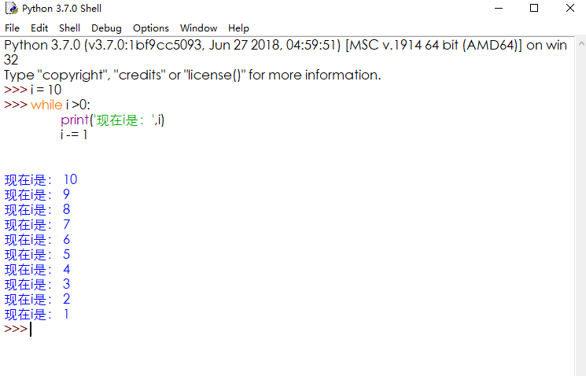

# 13.循环

## 循环

举例：

汽车打开引擎开关，发动机就会一直工作，直到关闭引擎。这就是日常常见的循环。


还有电风扇，你通电后打开开关它就一直工作，直到断电以后才停止工作。


想一想，以上举例的两种，让它们开始循环的条件各是什么？

## while循环

### while循环的格式

```python
while 条件:
条件满足时，做的事情1
条件满足时，做的事情2
条件满足时，做的事情3
```



### while循环嵌套：

前面学习过if的嵌套了，想一想if嵌套是什么样子的？类似if的嵌套，while嵌套就是：while里面还有while。

格式：

```python
while 条件1:
	条件1满足时，做的事情1
	while 条件2:
            条件2满足时，做的事情1
```

### while嵌套应用：

要求：打印如下图形：			

 \*

 \* \*

\* \* \*

\* \* \* \*

\* \* \* \* \*

参考代码：

```python
i = 1
while i<=5:
    j = 1
    while j<=i:
        print("* ",end='')
        j+=1
    print("\n")
    i+=1
```

   

## for循环：

像while循环一样，for可以完成循环的功能。

在Python中 for循环可以遍历任何序列的项目，如一个列表或者一个字符串等。

### for循环的格式

```python
for 临时变量 in 列表或者字符串等:
    循环满足条件时执行的代码
else:
    循环不满足条件时执行的代码
```

例： 


## break和continue：

顾名思义，前者终止，后者继续。在程序里他们扮演的角色和他们的本意是一样的。

Break例：


在while循环中也可以加入break控制，这样达到你的目的后不会再继续运行程序。

Continue例：

Continue的作用是跳过本次紧接着执行下一个。


总结：

循环和判断都是可以互相嵌套使用的，从而完成更复杂的程序。

练一练：

	要求：从键盘获取用户名和密码模拟登陆，如果用户名和密码都正确的话就输出登陆成功字样，否则告知用户登陆失败，请从新输入。

提示：

	用户名和密码事先预设两个变量即可，也可以利用目前所学的知识进行优化。

