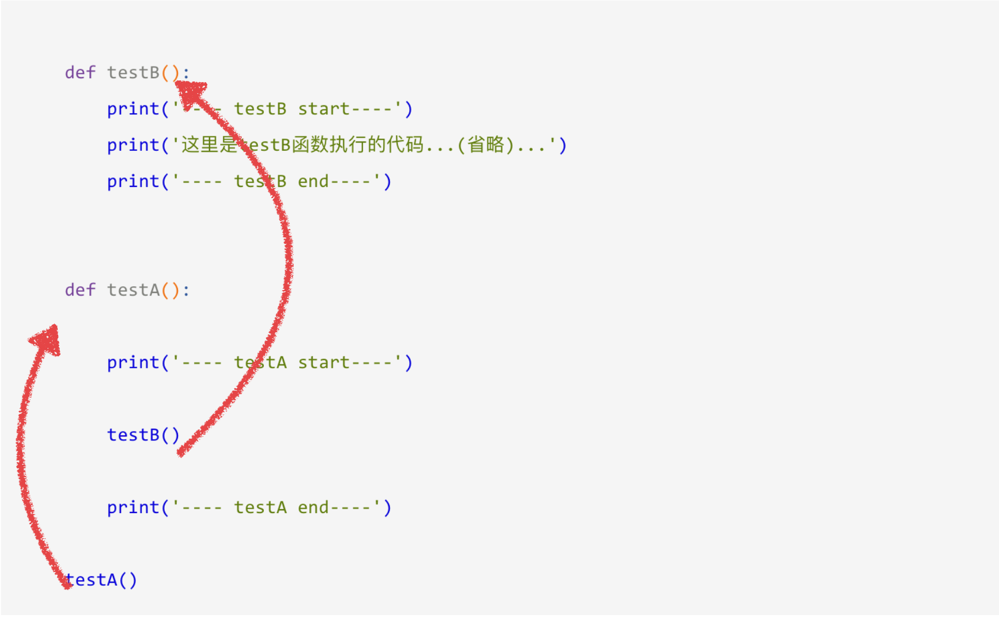

# 14.函数

## 函数：

如果在开发程序时，需要某块代码多次，但是为了提高编写的效率以及代码的重用，所以把具有独立功能的代码块组织为一个小模块，这就是函数。

#### 定义函数：

定义函数的格式如下：

```python
def 函数名():
代码
```

### 调用函数：

定义了函数之后，就相当于有了一个具有某些功能的代码，想要让这些代码能够执行，需要调用它

调用函数很简单的，通过 函数名\(\) 即可完成调用


 练一练：

要求：定义一个函数，能够输出自己的姓名和年龄，并且调用这个函数让它执行

使用def定义函数

编写完函数之后，调用函数

## 函数参数：

### 定义带有参数的函数：

示例：

```python
def addto(a, b):
c = a+b
print c
```

### 调用带有参数的函数：

以调用上面的addto\(a, b\)函数为例:

```python
def addto(a, b):
c = a+b
print c

addto(11, 22) #调用带有参数的函数时，需要在小括号中，传递数据
```

#### 练一练:

要求：定义一个函数，完成前2个数完成加法运算，然后对第3个数，进行减法；然后调用这个函数

使用def定义函数，要注意有3个参数

调用的时候，这个函数定义时有几个参数，那么就需要传递几个参数

#### 小总结：

定义时小括号中的参数，用来接收参数用的，称为 “形参”

调用时小括号中的参数，用来传递给函数用的，称为 “实参”

##  函数返回值：

### “返回值”介绍：

所谓“返回值”，就是程序中函数完成一件事情后，最后给调用者的结果。

举个例子，定义一个求和的函数，最后的和的值返回给函数调用者。

### 带有返回值的函数

想要在函数中把结果返回给调用者，需要在函数中使用return

如下示例:

```python
def add(a, b):
c = a+b
return c

或者

def add(a, b):
return a+b
```

### 保存函数的返回值：

如果一个函数返回了一个数据，那么想要用这个数据，那么就需要保存

保存函数的返回值示例如下:

```python
#定义函数
def add(a, b):
return a+b

#调用函数，顺便保存函数的返回值
result = add(100,98)

#因为result已经保存了add2num的返回值，所以接下来就可以使用了
print result

结果:
    198
```

##  函数类型：

### 4种函数的类型：

函数根据有没有参数，有没有返回值，可以相互组合，一共有4种

无参数，无返回值

无参数，有返回值

有参数，无返回值

有参数，有返回值

### （1）无参数，无返回值的函数

此类函数，不能接收参数，也没有返回值，一般情况下，打印提示类的功能，使用这类的函数

### （2）无参数，有返回值的函数

此类函数，不能接收参数，但是可以返回某个数据，一般情况下，像采集数据，用此类函数

### （3）有参数，无返回值的函数

此类函数，能接收参数，但不可以返回数据，一般情况下，对某些变量设置数据而不需结果时，用此类函数

### （4）有参数，有返回值的函数

此类函数，不仅能接收参数，还可以返回某个数据，一般情况下，像数据处理并需要结果的应用，用此类函数

### 不定长参数 <a id="2&#x4E0D;&#x5B9A;&#x957F;&#x53C2;&#x6570;"></a>

有时可能需要一个函数能处理比当初声明时更多的参数。这些参数叫做不定长参数，声明时不会命名。

基本语法如下：

```python
 def functionname([formal_args,] *args, **kwargs):
 "函数_文档字符串"
     function_suite
    return [expression]
```

加了星号（\*）的变量args会存放所有未命名的变量参数，args为元组；而加\*\*的变量kwargs会存放命名参数，即形如key=value的参数， kwargs为字典。

### 小总结：

函数根据有没有参数，有没有返回值可以相互组合。定义函数时，是根据实际的功能需求来设计的，所以不同开发人员编写的函数类型各不相同

## 递归函数 <a id="&#x9012;&#x5F52;&#x51FD;&#x6570;"></a>

### 什么是递归函数 <a id="&#x4EC0;&#x4E48;&#x662F;&#x9012;&#x5F52;&#x51FD;&#x6570;"></a>

通过前面的学习知道一个函数可以调用其他函数。

如果一个函数在内部不调用其它的函数，而是自己本身的话，这个函数就是递归函数。


## 匿名函数 <a id="&#x533F;&#x540D;&#x51FD;&#x6570;"></a>

用lambda关键词能创建小型匿名函数。这种函数得名于省略了用def声明函数的标准步骤。

lambda函数的语法只包含一个语句，如下：

```python
lambda [arg1 [,arg2,.....argn]]:expression
```

如下实例：

```python
sum = lambda arg1, arg2: arg1 + arg2

#调用sum函数
print "Value of total : ", sum( 10, 20 )
print "Value of total : ", sum( 20, 20 )
```

以上实例输出结果：

```python
Value of total :  30
Value of total :  40
```

Lambda函数能接收任何数量的参数但只能返回一个表达式的值

匿名函数不能直接调用print，因为lambda需要一个表达式

### 应用场合 <a id="&#x5E94;&#x7528;&#x573A;&#x5408;"></a>

**函数作为参数传递**

1. 自己定义函数

   ```python
   >>> def fun(a, b, opt):
   ...     print "a =", a
   ...     print "b =", b
   ...     print "result =", opt(a, b)
   ...
   >>> fun(1, 2, lambda x,y:x+y)
   a = 1
   b = 2
   result = 3
   ```

2. 作为内置函数的参数


## 函数的嵌套调用 <a id="&#x51FD;&#x6570;&#x7684;&#x5D4C;&#x5957;&#x8C03;&#x7528;"></a>

```python
def testB():
    print('---- testB start----')
    print('这里是testB函数执行的代码......')
    print('---- testB end----')


def testA():

    print('---- testA start----')

    testB()

    print('---- testA end----')

    testA()
```

结果：

```python
---- testA start----
---- testB start----
这里是testB函数执行的代码......
---- testB end----
---- testA end----
```

**小总结：**

* 一个函数里面又调用了另外一个函数，这就是所谓的函数嵌套调用 
* 如果函数A中，调用了另外一个函数B，那么先把函数B中的任务都执行完毕之后才会回到上次 函数A执行的位置

### 在python中我们可不可以返回多个值？

```python
>>> def divid(a, b):
...     shang = a//b
...     yushu = a%b 
...     return shang, yushu
...
>>> sh, yu = divid(5, 2)
>>> sh
5
>>> yu
1
```

**本质是利用了元组**

