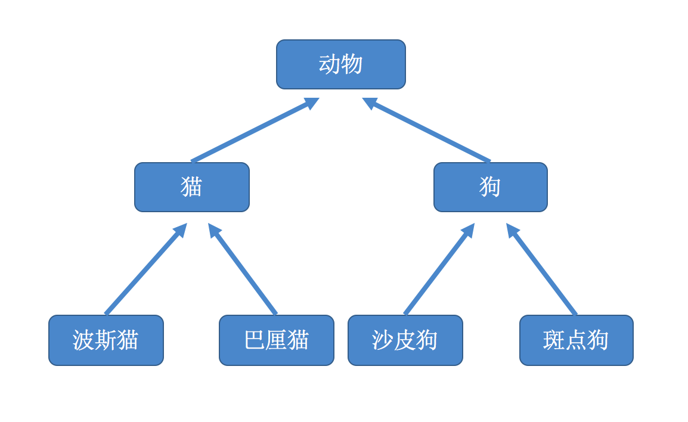

# 16.面向对象

## 面向对象编程介绍 <a id="&#x9762;&#x5411;&#x5BF9;&#x8C61;&#x7F16;&#x7A0B;&#x4ECB;&#x7ECD;"></a>

**请用程序描述如下事情：**

A同学报道登记信息

B同学报道登记信息

C同学报道登记信息

A同学做自我介绍

B同学做自我介绍

C同学做自我介绍

```python
stu_a= {
        "name":"A",
        "age":21,
        "gender":1,
        "hometown":"河北"
}
stu_b = {
        "name":"B",
        "age":22,
        "gender":0,
        "hometown":"山东"
}
stu_c = {
        "name":"C",
        "age":20,
        "gender":1,
        "hometown":"安徽"
}
def stu_intro(stu):
        """自我介绍"""
for key, value in stu.items():
        print("key=%s, value=%d"%(key,value))

stu_intro(stu_a)
stu_intro(stu_b)
stu_intro(stu_c)
```

考虑现实生活中，我们的思维方式是放在学生这个个人上，是学生做了自我介绍。而不是像我们刚刚写出的代码，先有了介绍的行为，再去看介绍了谁。

**用我们的现实思维方式该怎么用程序表达呢？**

```python
stu_a = Student(个人信息)
stu_b = Student(个人信息)
stu_c = Student(个人信息)
stu_a.intro()
stu_a.intro()
stu_a.intro()
```

面向过程：根据业务逻辑从上到下写代码

面向对象：将数据与函数绑定到一起，进行封装，这样能够更快速的开发程序，减少了重复代码的重写过程

面向过程编程最易被初学者接受，其往往用一长段代码来实现指定功能，开发过程的思路是将数据与函数按照执行的逻辑顺序组织在一起，数据与函数分开考虑。

```python
def 发送邮件(内容)
        #发送邮件提醒
        连接邮箱服务器
        发送邮件
        关闭连接

while True：

        if cpu利用率 > 90%:
                发送邮件('CPU报警')

        if 硬盘使用空间 > 90%:
                发送邮件('硬盘报警')

        if 内存占用 > 80%:
                发送邮件('内存报警')
```

今天我们来学习一种新的编程方式：面向对象编程（Object Oriented Programming，OOP，面向对象程序设计）

1）解决小白买汽车的事

第一种方式:

> 1\)在网上查资料口碑
>
> 2\)根据自己预算和喜好看上了一款野马轿车 中配 35万
>
> 3\)去市场找到卖车各种店无法判断是否是新车 随便找了一家
>
> 4\)找到业务员,业务员推荐了另外一款 配置更高价格便宜,也是福特公司出的售价28万
>
> 5\)砍价2小时 付款27.99万
>
> 6\)成交
>
> 回去之后发现各种问题

第二种方式 :

> 1\)找一个靠谱的买车高手
>
> 2\)给钱交易

面向对象和面向过程都是解决问题的一种思路而已

买车第一种方式:

1. 强调的是步骤、过程、每一步都是自己亲自去实现的
2. 这种解决问题的思路我们就叫做面向过程

第二种方式:

1. 强调的是买车高手, 买车高手是处理这件事的主角,对我们而言,我们并不必亲自实现整个步骤只需要调用买车高手就可以解决问题
2. 这种解决问题的思路就 是面向对象

* 用面向对象的思维解决问题的重点
  * 当遇到一个需求的时候不用自己去实现，如果自己一步步实现那就是面向过程
  * 应该找一个专门做这个事的人来做
  * 面向对象是基于面向过程的

解决购买机票的问题

第一种方式（面向过程）:

> 1去登陆民航官网
>
> 2登录账号
>
> 3添加乘机人
>
> 4选择目的地
>
> 5选择价位
>
> 6付款
>
> 7值机登机

第二种方式（面向对象）:

> 1交给助理订票
>
> 2值机登机


需要了解的定义性文字:

面向对象\(object-oriented ;简称: OO\) 至今还没有统一的概念 我这里把它定义为: 按人们 认识客观世界的系统思维方式,采用基于对象\(实体\) 的概念建立模型,模拟客观世界分析、设 计、实现软件的办法。

面向对象编程\(Object Oriented Programming-OOP\) 是一种解决软件复用的设计和编程方法。 这种方法把软件系统中相近相似的操作逻辑和操作 应用数据、状态,以类的型式描述出来,以对象实例的形式在软件系统中复用,以达到提高软件开发效率的作用。


## 类和对象 <a id="&#x7C7B;&#x548C;&#x5BF9;&#x8C61;"></a>

面向对象编程的2个非常重要的概念：类和对象

对象是面向对象编程的核心，在使用对象的过程中，为了将具有共同特征和行为的一组对象抽象定义，提出了另外一个新的概念——类

类就相当于制造游艇时的图纸，用它来进行创建的游艇就相当于对象

##  类

```python
人以类聚 物以群分。
具有相似内部状态和运动规律的实体的集合(或统称为抽象)。 
具有相同属性和行为事物的统称
好比生物界的各种植物类动物类
```

类是抽象的,在使用的时候通常会找到这个类的一个具体的存在,使用这个具体的存在。一个类可以找到多个对象


### 2. 对象 <a id="2-&#x5BF9;&#x8C61;"></a>

```python
某一个具体实物的存在 ,在现实世界中可以是看得见摸得着的。

实际生产出来的
```


### 3. 类和对象之间的关系 <a id="3-&#x7C7B;&#x548C;&#x5BF9;&#x8C61;&#x4E4B;&#x95F4;&#x7684;&#x5173;&#x7CFB;"></a>


犬类分很多品种。

小总结：类就是创建对象的模板

### 4. 练习：区分类和对象 <a id="4-&#x7EC3;&#x4E60;&#xFF1A;&#x533A;&#x5206;&#x7C7B;&#x548C;&#x5BF9;&#x8C61;"></a>

```python
汽车 类
轮船 类 
小王 对象
狗 类
大狗 类 
李四 对象 
水果 类
苹果 类 
```

### 5. 类的构成 <a id="5-&#x7C7B;&#x7684;&#x6784;&#x6210;"></a>

类\(Class\) 由3个部分构成

* 类的名称:类名
* 类的属性:数据特征
* 类的方法:允许对进行操作的方法 \(行为\)

 **举例：**

人类:

* 事物名称\(类名\):人
* 属性:身高、年龄、性别
* 方法（行为）:吃、喝、睡、说话、跑、跳、学习

犬类：

* 类名:狗
* 属性:品种 、毛色、性别、
* 方法\(行为\):叫 、跑、咬、吃

### 类的抽象 <a id="6-&#x7C7B;&#x7684;&#x62BD;&#x8C61;"></a>

如何把日常生活中的事物抽象成程序中的类?

拥有相同\(或者类似\)属性和行为的对象都可以抽像出一个类

方法:一般名词都是类\(名词提炼法\)

练一练：

找出这句话中的类

有个美女在街上遛狗没拴狗绳把路边的草地踩了还在草地上拉了粑粑，拉完以后还把人给咬了。


## 定义类 <a id="&#x5B9A;&#x4E49;&#x7C7B;"></a>

定义一个类，格式如下：

```python
class 类名:
    方法列表
```

demo：定义一个Car类

```python
# 定义类
class Car:
    # 方法
def getCarInfo(self):
    print('车轮子个数:%d, 颜色%s'%(self.wheelNum, self.color))

def move(self):
    print("车正在移动...")
```

**说明：**

* 定义类时有2种：新式类和经典类，上面的Car为经典类，如果是Car\(object\)则为新式类
* 类名 的命名规则按照"大驼峰"


## 创建对象 <a id="&#x521B;&#x5EFA;&#x5BF9;&#x8C61;"></a>

通过上一节课程，定义了一个Car类；就好比有车一个张图纸，那么接下来就应该把图纸交给生成工人们去生产了

Python中，可以根据已经定义的类去创建出一个个对象

创建对象的格式为:

```python
对象名 = 类名()
```

创建对象demo:

```python

# 定义类
class Car:
    # 移动
    def move(self):
        print('车在加速...')

    # 按喇叭
    def toot(self):
        print("车在鸣笛...叭叭叭..")


# 创建一个对象，并用变量BMW来保存它的引用
BMW = Car()
BMW.color = '黑色'
BMW.wheelNum = 4 #轮子数量
BMW.move()
BMW.toot()
print(BMW.color)
print(BMW.wheelNum)
```

### 总结： <a id="&#x603B;&#x7ED3;&#xFF1A;"></a>

* BMW = Car\(\)，这样就产生了一个Car的实例对象，此时也可以通过实例对象BMW来访问属性或者方法
* 第一次使用BMW.color = '黑色'表示给BMW这个对象添加属性，如果后面再次出现BMW.color = xxx表示对属性进行修改
* BMW是一个对象，它拥有属性（数据）和方法（函数）
* 当创建一个对象时，就是用一个模子，来制造一个实物 


## `__init__()`方法 <a id="init&#x65B9;&#x6CD5;"></a>

想一想:

> 在上一小节的demo中，我们已经给BMW这个对象添加了2个属性，wheelNum（车的轮胎数量）以及color（车的颜色），试想如果再次创建一个对象的话，肯定也需要进行添加属性，显然这样做很费事，那么有没有办法能够在创建对象的时候，就顺便把车这个对象的属性给设置呢？

答:

> `__init__()`方法

### 使用方式 <a id="&#x4F7F;&#x7528;&#x65B9;&#x5F0F;"></a>

```python
def 类名:
    #初始化函数，用来完成一些默认的设定
    def __init__():
        pass
```

### `__init__()`方法的调用 <a id="init&#x65B9;&#x6CD5;&#x7684;&#x8C03;&#x7528;"></a>

```python
# 定义汽车类
class Car:

    def __init__(self):
        self.wheelNum = 4
        self.color = '骚红'

    def move(self):
        print('正在加速前进')

# 创建对象
BMW = Car()

print('车的颜色为:%s'%BMW.color)
print('车轮胎数量为:%d'%BMW.wheelNum)

#输出
>>>车的颜色为：红色
>>>车的轮胎数量为：4
```

**总结**

> 当创建Car对象后，在没有调用`__init__()`方法的前提下，BMW就默认拥有了2个属性wheelNum和color，原因是`__init__()`方法是在创建对象后，就立刻被默认调用了

### 想一想 <a id="&#x60F3;&#x4E00;&#x60F3;"></a>

> 既然在创建完对象后`__init__()`方法已经被默认的执行了，那么能否让对象在调用`__init__()`方法的时候传递一些参数呢？如果可以，那怎样传递呢？

```python

# 定义汽车类
class Car:

    def __init__(self, newWheelNum, newColor):
        self.wheelNum = newWheelNum
        self.color = newColor

    def move(self):
        print('正在加速前进')

# 创建对象
BMW = Car(4, 'red')

print('车的颜色为:%s'%BMW.color)
print('车轮子数量为:%d'%BMW.wheelNum)
#输出
>>>车的颜色为：red
>>>车轮子数量为：4
```

**总结**

1. `__init__()`方法，在创建一个对象时默认被调用，不需要手动调用
2. `__init__(self)`中，默认有1个参数名字为self，如果在创建对象时传递了2个实参，那么`__init__(self)`中出了self作为第一个形参外还需要2个形参，例如`__init__(self,x,y)`
3. `__init__(self)`中的self参数，不需要开发者传递，python解释器会自动把当前的对象引用传递进去


## "magic"方法 <a id="&#x9B54;&#x6CD5;&#x65B9;&#x6CD5;"></a>

###  打印id\(\) <a id="1-&#x6253;&#x5370;id"></a>

如果把BMW使用print进行输出的话，即看到的是创建出来的BMW对象在内存中的地址。

###  定义`__str__()`方法 <a id="2-&#x5B9A;&#x4E49;str&#x65B9;&#x6CD5;"></a>

```python
class Car:

    def __init__(self, newWheelNum, newColor):
        self.wheelNum = newWheelNum
        self.color = newColor

    def __str__(self):
        msg = "你好。。。我的颜色是" + self.color + "我有" + int(self.wheelNum) + "个轮胎..."
        return msg

    def move(self):
        print('车正在加速')


BMW = Car(4, '炫丽红')
print(BMW)
```


**总结**

* 在python中方法名如果是`__xxxx__()`的，那么就有特殊的功能，因此叫做“魔法”方法
* 当使用print输出对象的时候，只要自己定义了`__str__(self)`方法，那么就会打印从在这个方法中return的数据

## self

### 理解self <a id="1-&#x7406;&#x89E3;self"></a>

self代表类的实例，而不是类。

```python
class test:
    def dpp(self):
        print(self)
        print(self.__class__)
a = test()
t.dpp()
执行结果：
<__main__.test object at 0x000000000284E080>
<class'__main__.test'>
```

注意：把self换成this，结果也一样，但Python中最好用约定俗成的self。

 从上面的例子中可以很明显的看出，self代表的是类的实例。而`self.__class__`则指向类。

#### 总结 <a id="&#x603B;&#x7ED3;"></a>

* 所谓的self，可以理解为自己
* 可以把self当做C++中类里面的this指针一样理解，就是对象自身的意思
* 某个对象调用其方法时，python解释器会把这个对象作为第一个参数传递给self，所以开发者只需要传递后面的参数即可

## **`__del__()`方法**

创建对象后，python解释器默认调用`__init__()`方法；

当删除一个对象时，python解释器也会默认调用一个方法，这个方法为`__del__()`方法

```python
import time
class Animal(object):

    # 初始化方法
    # 创建完对象后会自动被调用
    def __init__(self, name):
        print('__init__方法被调用')
        self.__name = name


    # 析构方法
    # 当对象被删除时，会自动被调用
    def __del__(self):
        print("__del__方法被调用")
        print("%s马上删除..."%self.__name)

# 创建对象
dog = Animal("吉娃娃")

# 删除对象
del dog


cat = Animal("折耳猫")
cat2 = cat
cat3 = cat

print("---马上 删除cat对象")
del cat
print("---马上 删除cat2对象")
del cat2
print("---马上 删除cat3对象")
del cat3

print("程序2秒钟后结束")
time.sleep(2)
```


**总结**

* 当有1个变量保存了对象的引用时，此对象的引用计数就会加1
* 当使用del删除变量指向的对象时，如果对象的引用计数不会1，比如3，那么此时只会让这个引用计数减1，即变为2，当再次调用del时，变为1，如果再调用1次del，此时会真的把对象进行删除

## **继承介绍以及单继承**

**1. 继承的概念**

在现实生活中，继承一般指的是子女继承父辈的财产，如下图


搞不好,结果如下..


在程序中，继承描述的是事物之间的所属关系，例如猫和狗都属于动物，程序中便可以描述为猫和狗继承自动物；同理，波斯猫和巴厘猫都继承自猫，而沙皮狗和斑点狗都继承足够，如下如所示：



**2. 继承示例**

```python
class people:
    #定义基本属性
    name = ''
    age = 0
    #定义私有属性,私有属性在类外部无法直接进行访问
    __weight = 0
    #定义构造方法
    def __init__(self,n,a,w):
        self.name = n
        self.age = a
        self.__weight = w
    def speak(self):
        print("%s 说: 我 %d 岁。" %(self.name,self.age))
 
#单继承示例
class student(people):
    grade = ''
    def __init__(self,n,a,w,g):
        #调用父类的构函
        people.__init__(self,n,a,w)
        self.grade = g
    #覆写父类的方法
    def speak(self):
        print("%s 说: 我 %d 岁了，我在读 %d 年级"%(self.name,self.age,self.grade))
 
 
 
s = student('ken',10,60,3)
s.speak()
执行以上程序输出结果为：

ken 说: 我 10 岁了，我在读 3 年级
```

说明：

* 虽然子类没有定义`__init__`方法，但是父类有，所以在子类继承父类的时候这个方法就被继承了，所以只要创建student的对象，就默认执行了那个继承过来的`__init__`方法

**总结**

* 子类在继承的时候，在定义类时，小括号\(\)中为父类的名字
* 父类的属性、方法，会被继承给子类

**3. 注意点**

* 私有的属性，不能通过对象直接访问，但是可以通过方法访问
* 私有的方法，不能通过对象直接访问
* 私有的属性、方法，不会被子类继承，也不能被访问
* 一般情况下，私有的属性、方法都是不对外公布的，往往用来做内部的事情，起到安全的作用


### 多继承

Python同样有限的支持多继承形式。多继承的类定义形如下例:class DerivedClassName\(Base1, Base2, Base3\): &lt;statement-1&gt; . . . &lt;statement-N&gt;

需要注意圆括号中父类的顺序，若是父类中有相同的方法名，而在子类使用时未指定，python从左至右搜索 即方法在子类中未找到时，从左到右查找父类中是否包含方法。

### 实例:

```python
Python同样有限的支持多继承形式。多继承的类定义形如下例:

class DerivedClassName(Base1, Base2, Base3):
    <statement-1>
    .
    .
    .
    <statement-N>
需要注意圆括号中父类的顺序，若是父类中有相同的方法名，而在子类使用时未指定，python从左至右搜索
即方法在子类中未找到时，从左到右查找父类中是否包含方法。

实例(Python 3.0+)
#!/usr/bin/python3
 
#类定义
class people:
    #定义基本属性
    name = ''
    age = 0
    #定义私有属性,私有属性在类外部无法直接进行访问
    __weight = 0
    #定义构造方法
    def __init__(self,n,a,w):
        self.name = n
        self.age = a
        self.__weight = w
    def speak(self):
        print("%s 说: 我 %d 岁。" %(self.name,self.age))
 
#单继承示例
class student(people):
    grade = ''
    def __init__(self,n,a,w,g):
        #调用父类的构函
        people.__init__(self,n,a,w)
        self.grade = g
    #覆写父类的方法
    def speak(self):
        print("%s 说: 我 %d 岁了，我在读 %d 年级"%(self.name,self.age,self.grade))
 
#另一个类，多重继承之前的准备
class speaker():
    topic = ''
    name = ''
    def __init__(self,n,t):
        self.name = n
        self.topic = t
    def speak(self):
        print("我叫 %s，我是一名教授，我演讲的主题是 %s"%(self.name,self.topic))
 
#多重继承
class sample(speaker,student):
    a =''
    def __init__(self,n,a,w,g,t):
        student.__init__(self,n,a,w,g)
        speaker.__init__(self,n,t)
 
test = sample("BOOS",25,80,4,"Python")
test.speak()   #方法名同，默认调用的是在括号中排前地父类的方法

执行以上程序输出结果为：

我叫 BOOS，我是一名教授，我演讲的主题是 Python
```

### 方法重写

如果你的父类方法的功能不能满足你的需求，你可以在子类重写你父类的方法，实例如下：

### 实例：

```python
#!/usr/bin/python3
 
class Parent:        # 定义父类
   def myMethod(self):
      print ('调用父类方法')
 
class Child(Parent): # 定义子类
   def myMethod(self):
      print ('调用子类方法')
 
c = Child()          # 子类实例
c.myMethod()         # 子类调用重写方法
super(Child,c).myMethod() #用子类对象调用父类已被覆盖的方法
super() 函数是用于调用父类(超类)的一个方法。

执行以上程序输出结果为：

调用子类方法
调用父类方法
```


## 类属性、实例属性 <a id="&#x7C7B;&#x5C5E;&#x6027;&#x3001;&#x5B9E;&#x4F8B;&#x5C5E;&#x6027;"></a>

在了解了类基本的东西之后，下面看一下python中这几个概念的区别

先来谈一下`类属性`和`实例属性`

在前面的例子中我们接触到的就是实例属性（对象属性），顾名思义，类属性就是`类对象`所拥有的属性，它被所有`类对象`的`实例对象`所共有，在内存中只存在一个副本，这个和C++中类的静态成员变量有点类似。对于公有的类属性，在类外可以通过`类对象`和`实例对象`访问

### 类属性 <a id="&#x7C7B;&#x5C5E;&#x6027;"></a>

```python
class People(object):
    name = 'BOOS'  #公有的类属性
    __age = 12     #私有的类属性

p = People()

print(p.name)           #正确
print(People.name)      #正确
print(p.__age)            #错误，不能在类外通过实例对象访问私有的类属性
print(People.__age)        #错误，不能在类外通过类对象访问私有的类属性
```

### 实例属性\(对象属性\) <a id="&#x5B9E;&#x4F8B;&#x5C5E;&#x6027;&#x5BF9;&#x8C61;&#x5C5E;&#x6027;"></a>

```python
class People(object):
    address = '山东' #类属性
    def __init__(self):
        self.name = 'xiaowang' #实例属性
        self.age = 20 #实例属性

p = People()
p.age =12 #实例属性
print(p.address) #正确
print(p.name)    #正确
print(p.age)     #正确

print(People.address) #正确
print(People.name)    #错误
print(People.age)     #错误
```

#### 通过实例\(对象\)去修改类属性 <a id="&#x901A;&#x8FC7;&#x5B9E;&#x4F8B;&#x5BF9;&#x8C61;&#x53BB;&#x4FEE;&#x6539;&#x7C7B;&#x5C5E;&#x6027;"></a>

```python
class People(object):
    country = 'China' #类属性


print(People.country)
p = People()
print(p.country)
p.country = 'italy' 
print(p.country)      #实例属性会屏蔽掉同名的类属性
print(People.country)
del p.country    #删除实例属性
print(p.country)
>>>运行结果
China
China
italy
China
China

```

#### 总结 <a id="&#x603B;&#x7ED3;"></a>

#### 类的专有方法：

1. \_\_init\_\_ : 构造函数，在生成对象时调用
2. \_\_del\_\_ : 析构函数，释放对象时使用
3. \_\_repr\_\_ : 打印，转换
4. \_\_setitem\_\_ : 按照索引赋值
5. \_\_getitem\_\_: 按照索引获取值
6. \_\_len\_\_: 获得长度
7. \_\_cmp\_\_: 比较运算
8. \_\_call\_\_: 函数调用
9. \_\_add\_\_: 加运算
10. \_\_sub\_\_: 减运算
11. \_\_mul\_\_: 乘运算
12. \_\_truediv\_\_: 除运算
13. \_\_mod\_\_: 求余运算
14. \_\_pow\_\_: 乘方

#### 运算符重载

如果需要在类外修改`类属性`，必须通过`类对象`去引用然后进行修改。如果通过实例对象去引用，会产生一个同名的`实例属性`，这种方式修改的是`实例属性`，不会影响到`类属性`，并且之后如果通过实例对象去引用该名称的属性，实例属性会强制屏蔽掉类属性，即引用的是`实例属性`，除非删除了该`实例属性`。

## 静态方法和类方法 <a id="&#x9759;&#x6001;&#x65B9;&#x6CD5;&#x548C;&#x7C7B;&#x65B9;&#x6CD5;"></a>

### 1. 类方法 <a id="1-&#x7C7B;&#x65B9;&#x6CD5;"></a>

是类对象所拥有的方法，需要用修饰器`@classmethod`来标识其为类方法，对于类方法，第一个参数必须是类对象，一般以`cls`作为第一个参数（当然可以用其他名称的变量作为其第一个参数，但是大部分人都习惯以'cls'作为第一个参数的名字，就最好用'cls'了），能够通过实例对象和类对象去访问。

```python
class People(object):
    country = 'China'

    #类方法，用classmethod来进行修饰
    @classmethod
    def getCountry(cls):
        return cls.country

p = People()
print p.getCountry()    #可以用过实例对象引用
print People.getCountry()    #可以通过类对象引用
```

类方法还有一个用途就是可以对类属性进行修改：

```python
class People(object):
    country = 'China'

    #类方法，用classmethod来进行修饰
    @classmethod
    def getCountry(cls):
        return cls.country

    @classmethod
    def setCountry(cls,country):
        cls.country = country


p = People()
print p.getCountry()    #可以用过实例对象引用
print People.getCountry()    #可以通过类对象引用

p.setCountry('italy')   

print p.getCountry()   
print People.getCountry()
#运行结果
>>>China
>>>China
>>>italy
>>>italy
```


结果显示在用类方法对类属性修改之后，通过类对象和实例对象访问都发生了改变

### 2. 静态方法 <a id="2-&#x9759;&#x6001;&#x65B9;&#x6CD5;"></a>

需要通过修饰器`@staticmethod`来进行修饰，静态方法不需要多定义参数

```python
class People(object):
    country = 'China'

    @staticmethod
    #静态方法
    def getCountry():
        return People.country


print People.getCountry()
```

### 总结 <a id="&#x603B;&#x7ED3;"></a>

从类方法和实例方法以及静态方法的定义形式就可以看出来，类方法的第一个参数是类对象cls，那么通过cls引用的必定是类对象的属性和方法；而实例方法的第一个参数是实例对象self，那么通过self引用的可能是类属性、也有可能是实例属性（这个需要具体分析），不过在存在相同名称的类属性和实例属性的情况下，实例属性优先级更高。静态方法中不需要额外定义参数，因此在静态方法中引用类属性的话，必须通过类对象来引用


## `__new__`方法 <a id="new&#x65B9;&#x6CD5;"></a>

### `__new__和__init__的不同` <a id="new&#x548C;init&#x7684;&#x4F5C;&#x7528;"></a>

```python
class A(object):
    def __init__(self):
        print("这是 init 方法")

    def __new__(cls):
        print("这是 new 方法")
        return object.__new__(cls)

A()
```

**总结**

1. `__new__`至少要有一个参数cls，代表要实例化的类，此参数在实例化时由Python解释器自动提供
2. `__new__`必须要有返回值，返回实例化出来的实例，这点在自己实现`__new__`时要特别注意，可以return父类`__new__`出来的实例，或者直接是object的`__new__`出来的实例
3. `__init__`有一个参数self，就是这个`__new__`返回的实例，`__init__`在`__new__`的基础上可以完成一些其它初始化的动作，`__init__`不需要返回值
4. 我们可以将类比作制造商，`__new__`方法就是前期的原材料购买环节，`__init__`方法就是在有原材料的基础上，加工，初始化商品环节

\*\*\*\*

