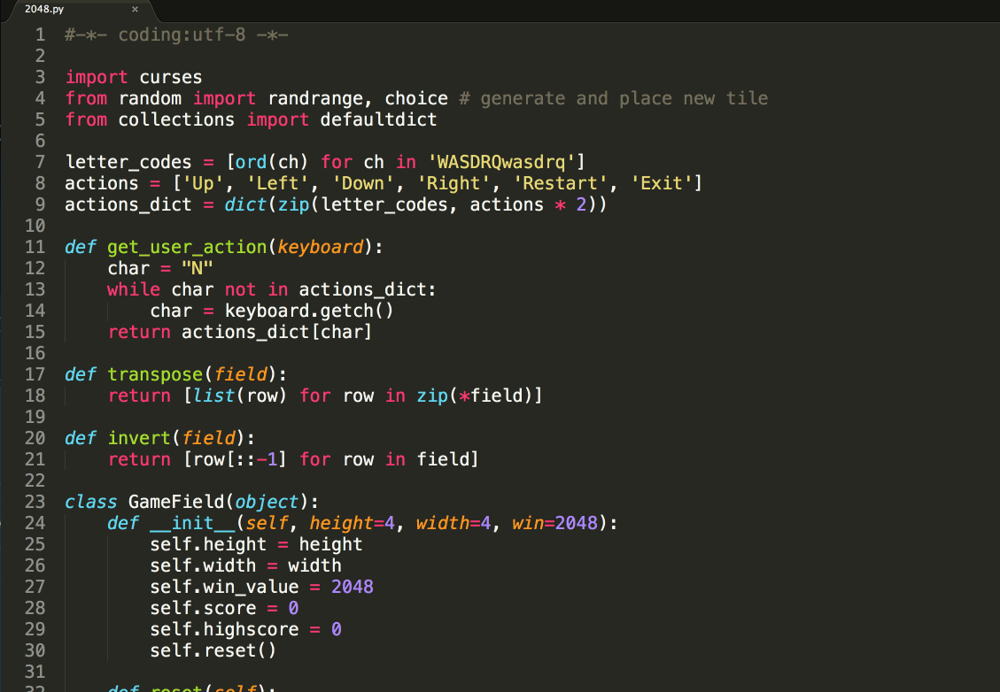
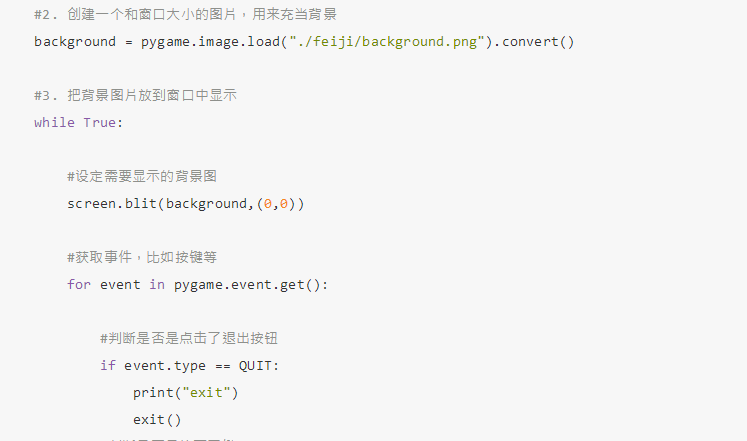
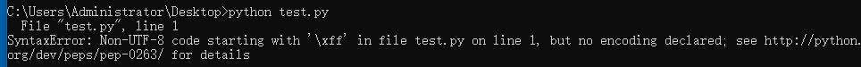

# 3.注释

## 1. 注释的引入

## &lt;1&gt; 看以下程序示例（未使用注释）



## &lt;2&gt; 看以下程序示例（使用注释）



### &lt;3&gt; 小总结（注释的作用） <a id="&#x5C0F;&#x603B;&#x7ED3;&#xFF08;&#x6CE8;&#x91CA;&#x7684;&#x4F5C;&#x7528;&#xFF09;"></a>

* 通过用自己熟悉的语言，在程序中对某些代码进行标注说明，这就是注释的作用，能够大大增强程序的可读性

## 2. 注释的分类 <a id="2-&#x6CE8;&#x91CA;&#x7684;&#x5206;&#x7C7B;"></a>

### &lt;1&gt; 单行注释 <a id="&#x5355;&#x884C;&#x6CE8;&#x91CA;"></a>

以\#开头，\#右边的所有东西当做说明，而不是真正要执行的程序，起辅助说明作用

```python
# 我是注释，可以在里写一些功能说明之类的哦
print('hello world')
```

### &lt;2&gt; 多行注释 <a id="&#x591A;&#x884C;&#x6CE8;&#x91CA;"></a>

```python
'''
    我是多行注释，可以写很多很多行的功能说明
        

'''

'''
    123456
    654321
        
        
'''

    
```

## 3. python程序中，中文支持 <a id="3-python&#x7A0B;&#x5E8F;&#x4E2D;&#xFF0C;&#x4E2D;&#x6587;&#x652F;&#x6301;"></a>

如果直接在程序中用到了中文，比如

```python
print('你好')
```

如果直接运行输出，程序会出错：



解决的办法为：在程序的开头写入如下代码，这就是中文注释

```python
#coding=utf-8
```

修改之后的程序:

```python
#coding=utf-8
print('你好')
```

运行结果:

```python
你好
```

**注意：**

在python的语法规范中推荐使用的方式：

```python
# -*- coding:utf-8 -*-
```


