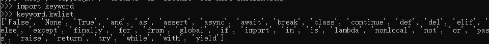

# 5.命名

### 命名规则 <a id="&#x6807;&#x793A;&#x7B26;&#x7684;&#x89C4;&#x5219;"></a>

* 由字母、下划线和数字组成，且数字不能开头

  > 思考：下面哪些是正确的，哪些不正确为什么
  >
  > ```python
  > fromNo12
  > from#12
  > my_Boolean
  > my-Boolean
  > Obj2
  > 2ndObj
  > myInt
  > test1
  > Mike2jack
  > My_tExt
  > _test
  > test!32
  > haha(da)tt
  > int
  > jack_rose
  > jack&rose
  > GUI
  > G.U.I
  > ```

*  Python 中的标识符是区分大小写的。

  以下划线开头的标识符是有特殊意义的。以单下划线开头 **\_bot** 的代表不能直接访问的类属性，需通过类提供的接口进行访问，不能用 **from xxx import \*** 而导入；

  以双下划线开头的 **\_\_bot** 代表类的私有成员；以双下划线开头和结尾的 **\_\_bot\_\_** 代表 Python 里特殊方法专用的标识，如 **\_\_init\_\_\(\)** 代表类的构造函数。


### 驼峰命名 <a id="&#x547D;&#x540D;&#x89C4;&#x5219;"></a>

* 有意义

  > 起一个有意义的名字，尽量做到看一眼就知道是什么意思\(提高代码可 读性\) 比如: 名字 就定义为 name , 定义学生 用 student

* 驼峰命名法


> 大驼峰式命名法： 每一个单字的首字母都采用大写字母，例如：FirstName、LastName


> 小驼峰式命名法： 每一个单字的首字母都采用大写字母，例如：aDog

> 不过在程序员中还有一种命名法比较流行，就是用下划线“\_”来连接所有的单词，比如send\_buf

### 关键字 <a id="&#x5173;&#x952E;&#x5B57;"></a>

* 什么是关键字

  > python一些具有特殊功能的标示符，这就是所谓的关键字
  >
  > 关键字，是python已经使用的了，所以不允许开发者自己定义和关键字相同的名字的标示符

* 查看关键字:

  ```python
  and     as      assert     break     class      continue    def     del
  elif    else    except     exec      finally    for         from    global
  if      in      import     is        lambda     not         or      pass
  print   raise   return     try       while      with        yield
  ```

可以通过以下命令进行查看当前系统中python的关键字



练一练：

1、说说Python中变量名的命名规范。

2、驼峰命名法是怎么定义的


