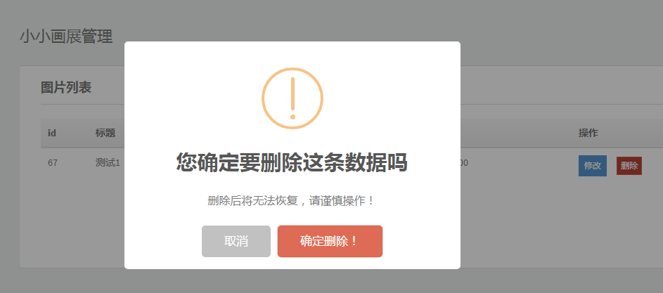

# 6.输出

## 输出

### 1. 普通的输出 <a id="1-&#x666E;&#x901A;&#x7684;&#x8F93;&#x51FA;"></a>

* 生活中的“输出”


* 软件中的“输出”



* python中变量的输出

```python
# 打印提示
print('hello world')
print('你好世界')
```

## 2. 格式化输出

#### &lt;1&gt;格式化操作的目的 <a id="&#x683C;&#x5F0F;&#x5316;&#x64CD;&#x4F5C;&#x7684;&#x76EE;&#x7684;"></a>

比如有以下代码:

```python
pirnt("我今年10岁")
pirnt("我今年11岁")
pirnt("我今年12岁")
...
```

* 想一想:

  > 在输出年龄的时候，用了多次"我今年xx岁"，能否简化一下程序呢？？？

* 答:

  > 字符串格式化

#### &lt;2&gt;什么是格式化 <a id="&#x4EC0;&#x4E48;&#x662F;&#x683C;&#x5F0F;&#x5316;"></a>

看如下代码:

```python
age = 10
print("我今年%d岁"%age)

age += 1
print("我今年%d岁"%age)

age += 1
print("我今年%d岁"%age)

...
```

在程序中，看到了`%`这样的操作符，这就是Python中格式化输出。

```python
age = 18
name = "xiaohua"
print("我的姓名是%s,年龄是%d"%(name,age))
```

#### &lt;3&gt;常用的格式符号 <a id="&#x5E38;&#x7528;&#x7684;&#x683C;&#x5F0F;&#x7B26;&#x53F7;"></a>

下面是完整的，它可以与％符号使用列表:

| 格式符号 | 转换 |
| :--- | :--- |
| %c | 字符 |
| %s | 通过str\(\) 字符串转换来格式化 |
| %i | 有符号十进制整数 |
| %d | 有符号十进制整数 |
| %u | 无符号十进制整数 |
| %o | 八进制整数 |
| %x | 十六进制整数（小写字母） |
| %X | 十六进制整数（大写字母） |
| %e | 索引符号（小写'e'） |
| %E | 索引符号（大写“E”） |
| %f | 浮点实数 |
| %g | ％f和％e 的简写 |
| %G | ％f和％E的简写 |

### 3. 换行输出 <a id="3-&#x6362;&#x884C;&#x8F93;&#x51FA;"></a>

在输出的时候，如果有`\n`那么，此时`\n`后的内容会在另外一行显示

```python
print("1234567890-------") # 会在一行显示

print("1234567890\n-------") # 一行显示1234567890，另外一行显示-------
```

### 4. 练一练 <a id="4-&#x7EC3;&#x4E00;&#x7EC3;"></a>

* 编写代码完成以下名片的显示

```python
*********************************
姓名: 明哥    
工号:123456
手机:1859999999
公司:北京龙域中心
**********************************
```

