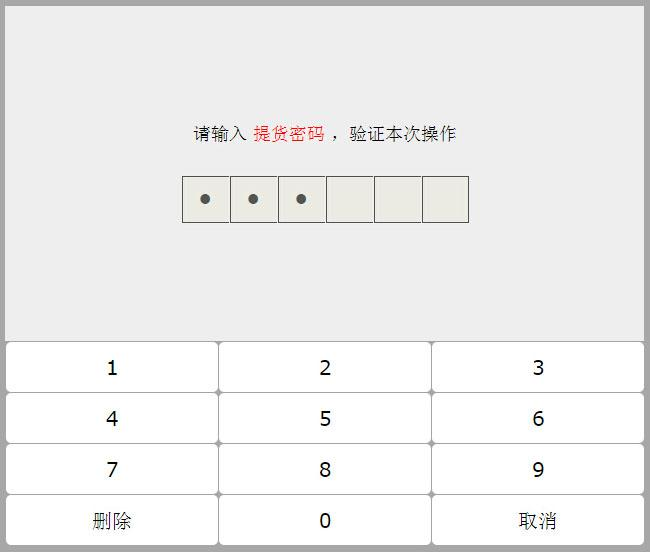

# 7.输入

## 1.python2.x.x版本中



在购物支付的时候，肯定需要输入密码。

那么怎样才能让程序知道咱们刚刚输入的是什么呢？？

大家应该知道了，如果要完成ATM机取钱这件事情，需要先从键盘中输入一个数据，然后用一个变量来保存，是不是很好理解啊

#### 1.1 raw\_input\(\) <a id="11-rawinput"></a>

在Python中，获取键盘输入的数据的方法是采用 raw\_input 函数（至于什么是函数，咱们以后的章节中讲解），那么这个 raw\_input 怎么用呢?

看如下示例:

```python
password = raw_input("请输入密码:")
print '您刚刚输入的密码是:', password
```

运行结果:


**注意**:

* raw\_input\(\)的小括号中放入的是，提示信息，用来在获取数据之前给用户的一个简单提示
* raw\_input\(\)在从键盘获取了数据以后，会存放到等号右边的变量中
* raw\_input\(\)会把用户输入的任何值都作为字符串来对待

#### 1.2 input\(\) <a id="12-input"></a>

input\(\)函数与raw\_input\(\)类似，但其接受的输入必须是表达式。

```python
a = input()
123
print(a)
>>>'123'
```

input\(\)接受表达式输入，并把表达式的结果赋值给等号左边的变量

### 2. python3.x.x版本中 <a id="2-python3&#x7248;&#x672C;&#x4E2D;"></a>

没有raw\_input\(\)函数，只有input\(\)

并且 python3中的input与python2中的raw\_input\(\)功能一样

