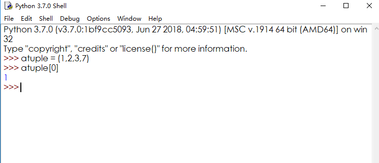
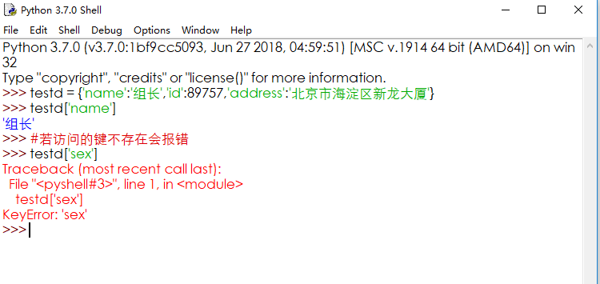

# 9.Python数据类型

## **Python3 数字（Number）：**

### **Python 数字数据类型用于存储数值。**

数据类型是不允许改变的,这就意味着如果改变数字数据类型的值，将重新分配内存空间。

Python 支持三种不同的数值类型：

整型\(Int\) - 通常被称为是整型或整数，是正或负整数，不带小数点。

Python3 整型是没有限制大小的，可以当作 Long 类型使用，所以 Python3 没有 Python2 的 Long 类型。

浮点型\(float\) - 浮点型由整数部分与小数部分组成，浮点型也可以使用科学计数法表示（2.5e2 = 2.5 x 102 = 250）

复数\( \(complex\)\) - 复数由实数部分和虚数部分构成，可以用a + bj,或者complex\(a,b\)表示， 复数的实部a和虚部b都是浮点型。

## Python3 字符串：

### **python中字符串的格式**

定义的变量b，存储的是字符串类型的值

    b = "hello world"

    或者

    b = 'hello world'

总结：

双引号或者单引号中的数据，就是字符串。

下标和切片

1. 下标索引

所谓的下标就是编号，就好比储物柜，你知道编号就能找到你的柜子，拿到你自己的东西。


电影院选座：


字符串下标与切片：


**演示：**


## **Python转义字符**

**在需要在字符中使用特殊字符时，python用反斜杠\(\\)转义字符。如下表：**

| **转义字符** | **描述** |
| :--- | :--- |
| \\(在行尾时\) | 续行符 |
| \\ | 反斜杠符号 |
| \' | 单引号 |
| \" | 双引号 |
| \a | 响铃 |
| \b | 退格\(Backspace\) |
| \e | 转义 |
| \000 | 空 |
| \n | 换行 |
| \v | 纵向制表符 |
| \t | 横向制表符 |
| \r | 回车 |
| \f | 换页 |
| \oyy | 八进制数，yy代表的字符，例如：\o12代表换行 |
| \xyy | 十六进制数，yy代表的字符，例如：\x0a代表换行 |
| \other | 其它的字符以普通格式输出 |

## **Python字符串运算符**

**下表实例变量a值为字符串 "Hello"，b变量值为 "Python"：**

| **操作符** | **描述** | **实例** |
| :--- | :--- | :--- |
| + | 字符串连接 | a + b 输出结果： HelloPython |
| \* | 重复输出字符串 | a\*2 输出结果：HelloHello |
| \[\] | 通过索引获取字符串中字符 | a\[1\] 输出结果 **e** |
| \[ : \] | 截取字符串中的一部分，遵循**左闭右开**原则，str\[0,2\] 是不包含第 3 个字符的。 | a\[1:4\] 输出结果 **ell** |
| in | 成员运算符 - 如果字符串中包含给定的字符返回 True | **'H' in a** 输出结果 True |
| not in | 成员运算符 - 如果字符串中不包含给定的字符返回 True | **'M' not in a** 输出结果 True |
| r/R | 原始字符串 - 原始字符串：所有的字符串都是直接按照字面的意思来使用，没有转义特殊或不能打印的字符。 原始字符串除在字符串的第一个引号前加上字母 **r**（可以大小写）以外，与普通字符串有着几乎完全相同的语法。 | print\( r'\n' \)print\( R'\n' \) |

## **Python字符串格式化**

**Python 支持格式化字符串的输出 。**

**尽管这样可能会用到非常复杂的表达式，但最基本的用法是将一个值插入到一个有字符串格式符 %s 的字符串中。**

**在 Python 中，字符串格式化使用与 C 中 sprintf 函数一样的语法。**

|     **符   号** | **描述** |
| :--- | :--- |
|       %c |  格式化字符及其ASCII码 |
|       %s |  格式化字符串 |
|       %d |  格式化整数 |
|       %u |  格式化无符号整型 |
|       %o |  格式化无符号八进制数 |
|       %x |  格式化无符号十六进制数 |
|       %X |  格式化无符号十六进制数（大写） |
|       %f |  格式化浮点数字，可指定小数点后的精度 |
|       %e |  用科学计数法格式化浮点数 |
|       %E |  作用同%e，用科学计数法格式化浮点数 |
|       %g |  %f和%e的简写 |
|       %G |  %f 和 %E 的简写 |
|       %p |  用十六进制数格式化变量的地址 |


## **Python3 的字符串内建函数**

**Python 的字符串常用内建函数如下：**

<table>
  <thead>
    <tr>
      <th style="text-align:left">序号</th>
      <th style="text-align:left">方法及描述</th>
    </tr>
  </thead>
  <tbody>
    <tr>
      <td style="text-align:left">1</td>
      <td style="text-align:left"><a href="http://www.runoob.com/python3/python3-string-capitalize.html">capitalize()</a>
        <br
        />将字符串的第一个字符转换为大写</td>
    </tr>
    <tr>
      <td style="text-align:left">2</td>
      <td style="text-align:left">
        <p><a href="http://www.runoob.com/python3/python3-string-center.html">center(width, fillchar)</a>
        </p>
        <p>
          <br />返回一个指定的宽度 width 居中的字符串，fillchar 为填充的字符，默认为空格。</p>
      </td>
    </tr>
    <tr>
      <td style="text-align:left">3</td>
      <td style="text-align:left">
        <p><a href="http://www.runoob.com/python3/python3-string-count.html">count(str, beg= 0,end=len(string))</a>
        </p>
        <p>
          <br />返回 str 在 string 里面出现的次数，如果 beg 或者 end 指定则返回指定范围内 str 出现的次数</p>
      </td>
    </tr>
    <tr>
      <td style="text-align:left">4</td>
      <td style="text-align:left">
        <p><a href="http://www.runoob.com/python3/python3-string-decode.html">bytes.decode(encoding="utf-8", errors="strict")</a>
        </p>
        <p>
          <br />Python3 中没有 decode 方法，但我们可以使用 bytes 对象的 decode() 方法来解码给定的 bytes 对象，这个
          bytes 对象可以由 str.encode() 来编码返回。</p>
      </td>
    </tr>
    <tr>
      <td style="text-align:left">5</td>
      <td style="text-align:left">
        <p><a href="http://www.runoob.com/python3/python3-string-encode.html">encode(encoding='UTF-8',errors='strict')</a>
        </p>
        <p>
          <br />以 encoding 指定的编码格式编码字符串，如果出错默认报一个ValueError 的异常，除非 errors 指定的是'ignore'或者'replace'</p>
      </td>
    </tr>
    <tr>
      <td style="text-align:left">6</td>
      <td style="text-align:left"><a href="http://www.runoob.com/python3/python3-string-endswith.html">endswith(suffix, beg=0, end=len(string))</a>
        <br
        />检查字符串是否以 obj 结束，如果beg 或者 end 指定则检查指定的范围内是否以 obj 结束，如果是，返回 True,否则返回 False.</td>
    </tr>
    <tr>
      <td style="text-align:left">7</td>
      <td style="text-align:left">
        <p><a href="http://www.runoob.com/python3/python3-string-expandtabs.html">expandtabs(tabsize=8)</a>
        </p>
        <p>
          <br />把字符串 string 中的 tab 符号转为空格，tab 符号默认的空格数是 8 。</p>
      </td>
    </tr>
    <tr>
      <td style="text-align:left">8</td>
      <td style="text-align:left">
        <p><a href="http://www.runoob.com/python3/python3-string-find.html">find(str, beg=0 end=len(string))</a>
        </p>
        <p>
          <br />检测 str 是否包含在字符串中，如果指定范围 beg 和 end ，则检查是否包含在指定范围内，如果包含返回开始的索引值，否则返回-1</p>
      </td>
    </tr>
    <tr>
      <td style="text-align:left">9</td>
      <td style="text-align:left">
        <p><a href="http://www.runoob.com/python3/python3-string-index.html">index(str, beg=0, end=len(string))</a>
        </p>
        <p>
          <br />跟find()方法一样，只不过如果str不在字符串中会报一个异常.</p>
      </td>
    </tr>
    <tr>
      <td style="text-align:left">10</td>
      <td style="text-align:left">
        <p><a href="http://www.runoob.com/python3/python3-string-isalnum.html">isalnum()</a>
        </p>
        <p>
          <br />如果字符串至少有一个字符并且所有字符都是字母或数字则返 回 True,否则返回 False</p>
      </td>
    </tr>
    <tr>
      <td style="text-align:left">11</td>
      <td style="text-align:left">
        <p><a href="http://www.runoob.com/python3/python3-string-isalpha.html">isalpha()</a>
        </p>
        <p>
          <br />如果字符串至少有一个字符并且所有字符都是字母则返回 True, 否则返回 False</p>
      </td>
    </tr>
    <tr>
      <td style="text-align:left">12</td>
      <td style="text-align:left">
        <p><a href="http://www.runoob.com/python3/python3-string-isdigit.html">isdigit()</a>
        </p>
        <p>
          <br />如果字符串只包含数字则返回 True 否则返回 False..</p>
      </td>
    </tr>
    <tr>
      <td style="text-align:left">13</td>
      <td style="text-align:left">
        <p><a href="http://www.runoob.com/python3/python3-string-islower.html">islower()</a>
        </p>
        <p>
          <br />如果字符串中包含至少一个区分大小写的字符，并且所有这些(区分大小写的)字符都是小写，则返回 True，否则返回 False</p>
      </td>
    </tr>
    <tr>
      <td style="text-align:left">14</td>
      <td style="text-align:left">
        <p><a href="http://www.runoob.com/python3/python3-string-isnumeric.html">isnumeric()</a>
        </p>
        <p>
          <br />如果字符串中只包含数字字符，则返回 True，否则返回 False</p>
      </td>
    </tr>
    <tr>
      <td style="text-align:left">15</td>
      <td style="text-align:left">
        <p><a href="http://www.runoob.com/python3/python3-string-isspace.html">isspace()</a>
        </p>
        <p>
          <br />如果字符串中只包含空白，则返回 True，否则返回 False.</p>
      </td>
    </tr>
    <tr>
      <td style="text-align:left">16</td>
      <td style="text-align:left">
        <p><a href="http://www.runoob.com/python3/python3-string-istitle.html">istitle()</a>
        </p>
        <p>
          <br />如果字符串是标题化的(见 title())则返回 True，否则返回 False</p>
      </td>
    </tr>
    <tr>
      <td style="text-align:left">17</td>
      <td style="text-align:left">
        <p><a href="http://www.runoob.com/python3/python3-string-isupper.html">isupper()</a>
        </p>
        <p>
          <br />如果字符串中包含至少一个区分大小写的字符，并且所有这些(区分大小写的)字符都是大写，则返回 True，否则返回 False</p>
      </td>
    </tr>
    <tr>
      <td style="text-align:left">18</td>
      <td style="text-align:left">
        <p><a href="http://www.runoob.com/python3/python3-string-join.html">join(seq)</a>
        </p>
        <p>
          <br />以指定字符串作为分隔符，将 seq 中所有的元素(的字符串表示)合并为一个新的字符串</p>
      </td>
    </tr>
    <tr>
      <td style="text-align:left">19</td>
      <td style="text-align:left">
        <p><a href="http://www.runoob.com/python3/python3-string-len.html">len(string)</a>
        </p>
        <p>
          <br />返回字符串长度</p>
      </td>
    </tr>
    <tr>
      <td style="text-align:left">20</td>
      <td style="text-align:left">
        <p><a href="http://www.runoob.com/python3/python3-string-ljust.html">ljust(width[, fillchar])</a>
        </p>
        <p>
          <br />返回一个原字符串左对齐,并使用 fillchar 填充至长度 width 的新字符串，fillchar 默认为空格。</p>
      </td>
    </tr>
    <tr>
      <td style="text-align:left">21</td>
      <td style="text-align:left">
        <p><a href="http://www.runoob.com/python3/python3-string-lower.html">lower()</a>
        </p>
        <p>
          <br />转换字符串中所有大写字符为小写.</p>
      </td>
    </tr>
    <tr>
      <td style="text-align:left">22</td>
      <td style="text-align:left">
        <p><a href="http://www.runoob.com/python3/python3-string-lstrip.html">lstrip()</a>
        </p>
        <p>
          <br />截掉字符串左边的空格或指定字符。</p>
      </td>
    </tr>
    <tr>
      <td style="text-align:left">23</td>
      <td style="text-align:left">
        <p><a href="http://www.runoob.com/python3/python3-string-maketrans.html">maketrans()</a>
        </p>
        <p>
          <br />创建字符映射的转换表，对于接受两个参数的最简单的调用方式，第一个参数是字符串，表示需要转换的字符，第二个参数也是字符串表示转换的目标。</p>
      </td>
    </tr>
    <tr>
      <td style="text-align:left">24</td>
      <td style="text-align:left">
        <p><a href="http://www.runoob.com/python3/python3-string-max.html">max(str)</a>
        </p>
        <p>
          <br />返回字符串 str 中最大的字母。</p>
      </td>
    </tr>
    <tr>
      <td style="text-align:left">25</td>
      <td style="text-align:left">
        <p><a href="http://www.runoob.com/python3/python3-string-min.html">min(str)</a>
        </p>
        <p>
          <br />返回字符串 str 中最小的字母。</p>
      </td>
    </tr>
    <tr>
      <td style="text-align:left">26</td>
      <td style="text-align:left">
        <p><a href="http://www.runoob.com/python3/python3-string-replace.html">replace(old, new [, max])</a>
        </p>
        <p>
          <br />把 将字符串中的 str1 替换成 str2,如果 max 指定，则替换不超过 max 次。</p>
      </td>
    </tr>
    <tr>
      <td style="text-align:left">27</td>
      <td style="text-align:left">
        <p><a href="http://www.runoob.com/python3/python3-string-rfind.html">rfind(str, beg=0,end=len(string))</a>
        </p>
        <p>
          <br />类似于 find()函数，不过是从右边开始查找.</p>
      </td>
    </tr>
    <tr>
      <td style="text-align:left">28</td>
      <td style="text-align:left">
        <p><a href="http://www.runoob.com/python3/python3-string-rindex.html">rindex( str, beg=0, end=len(string))</a>
        </p>
        <p>
          <br />类似于 index()，不过是从右边开始.</p>
      </td>
    </tr>
    <tr>
      <td style="text-align:left">29</td>
      <td style="text-align:left">
        <p><a href="http://www.runoob.com/python3/python3-string-rjust.html">rjust(width,[, fillchar])</a>
        </p>
        <p>
          <br />返回一个原字符串右对齐,并使用fillchar(默认空格）填充至长度 width 的新字符串</p>
      </td>
    </tr>
    <tr>
      <td style="text-align:left">30</td>
      <td style="text-align:left">
        <p><a href="http://www.runoob.com/python3/python3-string-rstrip.html">rstrip()</a>
        </p>
        <p>
          <br />删除字符串字符串末尾的空格.</p>
      </td>
    </tr>
    <tr>
      <td style="text-align:left">31</td>
      <td style="text-align:left">
        <p><a href="http://www.runoob.com/python3/python3-string-split.html">split(str="", num=string.count(str))</a>
        </p>
        <p>
          <br />num=string.count(str)) 以 str 为分隔符截取字符串，如果 num 有指定值，则仅截取 num 个子字符串</p>
      </td>
    </tr>
    <tr>
      <td style="text-align:left">32</td>
      <td style="text-align:left">
        <p><a href="http://www.runoob.com/python3/python3-string-splitlines.html">splitlines([keepends])</a>
        </p>
        <p>
          <br />按照行('\r', '\r\n', \n')分隔，返回一个包含各行作为元素的列表，如果参数 keepends 为 False，不包含换行符，如果为
          True，则保留换行符。</p>
      </td>
    </tr>
    <tr>
      <td style="text-align:left">33</td>
      <td style="text-align:left">
        <p><a href="http://www.runoob.com/python3/python3-string-startswith.html">startswith(str, beg=0,end=len(string))</a>
        </p>
        <p>
          <br />检查字符串是否是以 obj 开头，是则返回 True，否则返回 False。如果beg 和 end 指定值，则在指定范围内检查。</p>
      </td>
    </tr>
    <tr>
      <td style="text-align:left">34</td>
      <td style="text-align:left">
        <p><a href="http://www.runoob.com/python3/python3-string-strip.html">strip([chars])</a>
        </p>
        <p>
          <br />在字符串上执行 lstrip()和 rstrip()</p>
      </td>
    </tr>
    <tr>
      <td style="text-align:left">35</td>
      <td style="text-align:left">
        <p><a href="http://www.runoob.com/python3/python3-string-swapcase.html">swapcase()</a>
        </p>
        <p>
          <br />将字符串中大写转换为小写，小写转换为大写</p>
      </td>
    </tr>
    <tr>
      <td style="text-align:left">36</td>
      <td style="text-align:left">
        <p><a href="http://www.runoob.com/python3/python3-string-title.html">title()</a>
        </p>
        <p>
          <br />返回"标题化"的字符串,就是说所有单词都是以大写开始，其余字母均为小写(见 istitle())</p>
      </td>
    </tr>
    <tr>
      <td style="text-align:left">37</td>
      <td style="text-align:left">
        <p><a href="http://www.runoob.com/python3/python3-string-translate.html">translate(table, deletechars="")</a>
        </p>
        <p>
          <br />根据 str 给出的表(包含 256 个字符)转换 string 的字符, 要过滤掉的字符放到 deletechars 参数中</p>
      </td>
    </tr>
    <tr>
      <td style="text-align:left">38</td>
      <td style="text-align:left">
        <p><a href="http://www.runoob.com/python3/python3-string-upper.html">upper()</a>
        </p>
        <p>
          <br />转换字符串中的小写字母为大写</p>
      </td>
    </tr>
    <tr>
      <td style="text-align:left">39</td>
      <td style="text-align:left">
        <p><a href="http://www.runoob.com/python3/python3-string-zfill.html">zfill (width)</a>
        </p>
        <p>
          <br />返回长度为 width 的字符串，原字符串右对齐，前面填充0</p>
      </td>
    </tr>
    <tr>
      <td style="text-align:left">40</td>
      <td style="text-align:left">
        <p><a href="http://www.runoob.com/python3/python3-string-isdecimal.html">isdecimal()</a>
        </p>
        <p>
          <br />检查字符串是否只包含十进制字符，如果是返回 true，否则返回 false。</p>
      </td>
    </tr>
  </tbody>
</table>## **Python3列表**

想一想：

前面学习的字符串可以用来存储一串信息，那么想一想，怎样存储咱们班所有同学的名字呢？

定义100个变量，每个变量存放一个学生的姓名可行吗？有更好的办法吗？

答：

列表

### **创建列表**

```python
NameList = ['lilei','hanxue','wangqiang']
```

比C语言的数组强大的地方在于列表中的元素可以是不同类型的

```python
TestList = [1, 'a']
```

### **打印列表**

### demo:

```python
NameList = ['lilei','hanxue','wangqiang']
print(NameList[0])
print(NameList[1])
print(NameList[2])
结果：
    lilei
    hanxue
    wangqiang
```

## **列表的操作：**

**列表的数据是可以进行修改的，可以增加元素，删除元素，修改元素，通过和字符串一样的下标索引元素。**

### **访问列表中的值：**

**使用下标索引来访问列表中的值，同样你也可以使用方括号的形式截取字符如下图所示：**


**添加元素：**

**append**

**通过append可以向列表添加元素，如图所示：**


**extend**

**通过extend可以将另一个集合中的元素逐一添加到列表中：**


**insert**

insert\(index, object\) 在指定位置index前插入元素object**：**


**修改元素：**

修改元素的时候，要通过下标来确定要修改的是哪个元素，然后才能进行修改


**查找元素：**

所谓的查找，就是看看指定的元素是否存在

in, not in

python中查找的常用方法为：

in（存在）,如果存在那么结果为true，否则为false

not in（不存在），如果不存在那么结果为true，否则false。


index, count：

index和count与字符串中的用法相同


### **删除元素：**

列表元素的常用删除方法有：

del：根据下标进行删除。

pop：删除最后一个元素。

remove：根据元素的值进行删除。


**排序：**

**sort方法是将list按特定顺序重新排列，默认为由小到大，参数reverse=True可改为倒序，由大到小。**

**reverse方法是将list逆序。**


**列表的嵌套：**

**一个列表中的元素又是一个列表，那么这就是列表的嵌套。**


**元组：**

**Python的元组与列表类似，不同之处在于元组的元素不能修改。元组使用小括号，列表使用方括号**

**访问元组：**



### **元组的内置函数count, index：**

**index和count与字符串和列表中的用法相同。**


**字典**：

**生活中的字典：**


**开发中的字典：**


字典和列表一样，也能够存储多个数据。

列表中找某个元素时，是根据下标进行的。

字典中找某个元素时，是根据'名字'（就是冒号:前面的那个值，例如上面代码中的'name'、'id'）

字典的每个元素由2部分组成，键:值。例如 'name':'组长' ,'name'为键，'组长'为值

根据键访问值：



修改元素：

字典的每个元素中的数据是可以修改的，只要通过key找到，即可修改。


添加元素：


删除元素：

对字典进行删除操作，有以下：


Del，删除

clear\(\)，清空


字典的操作：


练一练：

要求：创建一个班级，里面不少于10名同学，并找出索引为3和5的同学并输出学生的信息

要求：在之前的班级里添加新来的6名同学，这6名同学的索引分别为，2，5，6，7，8，1

