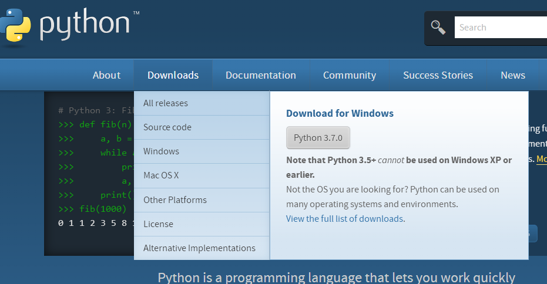
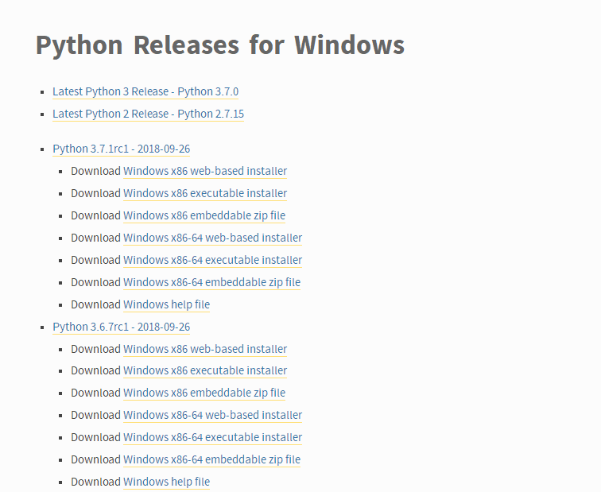
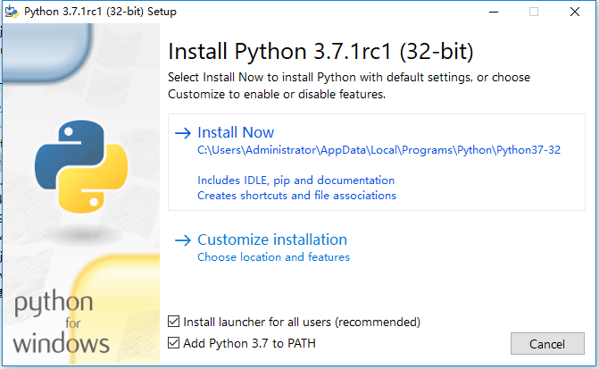
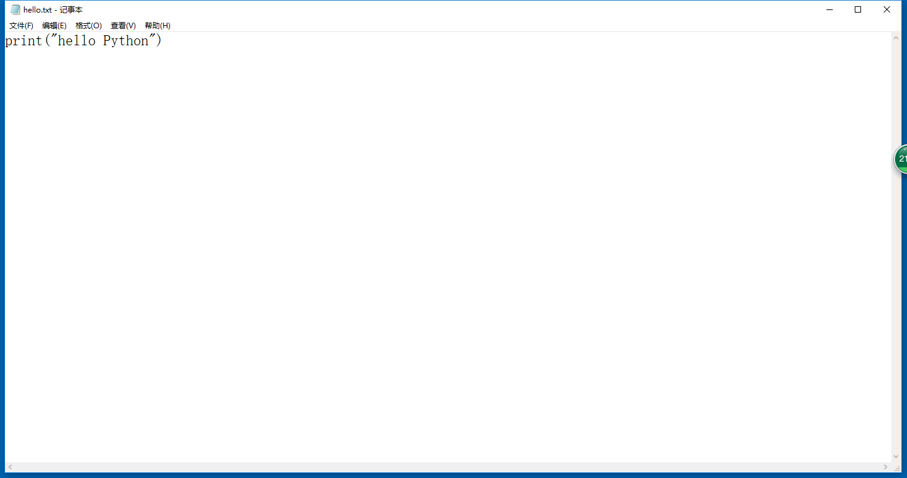
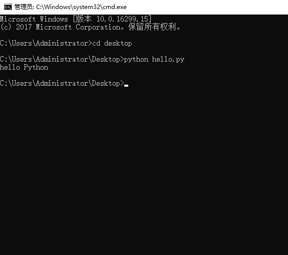

# 2.第一个Python程序

环境搭建和第一个python程序

Python3下载：

Python3相关的信息以及新闻资讯都在官网看到：

python3官网：www.python.org

写入完毕后保存文件为：.py 后缀，python的文件都是以py结尾。

打开Windows的cmd，命令行。操作如图。

练一练：

要求编写一个程序输出 life is short，I need python

\*\*\*\*

